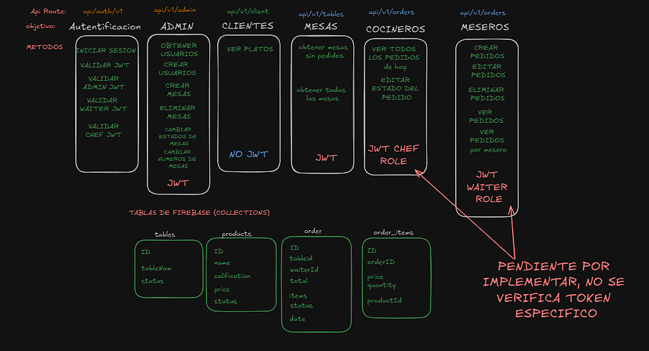

# DineFlow API

DineFlow API is a backend service built with Express.js designed to manage the flow of orders and interactions between customers, waiters, and chefs in a restaurant setting. The API facilitates user authentication, order management, and real-time communication between staff members.

# Current STATE 16/08/2024


## Project Structure
project-root/  
│  
├── src/  
│ ├── config/  
│ │ └── firebase-admin.js  
│ │ └── firebase.js  
│ │
│ ├── controllers/  
│ │ └── admin.controller.js   
│ │ └── auth.controller.js  
│ │ └── order.controller.js  
│ │ └── product.controller.js  
│ │ └── table.controller.js  
│ │  
│ ├── middlewares/  
│ │ └── ...  
│ │  
│ ├── models/  
│ │ └── admin.models.js  
│ │ └── auth.models.js  
│ │ └── order.models.js  
│ │ └── product.models.js  
│ │ └── server.models.js  
│ │ └── table.models.js    
│ │  
│ ├── routes/  
│ │ └── admin.route.js  
│ │ └── auth.route.js  
│ │ └── order.route.js  
│ │ └── product.route.js  
│ │ └── table.route.js  
│ │  
│ ├── services/  
│ │ └── ...  
│ │  
│ ├── sockets/  
│ │ └── ...  
│ │  
│ ├── utils/    
│ │ └── addRolesUsers.js  
│ │  
│ ├── app.js  
│ └── server.js  
│  
├── tests/  
│ ├── controllers/  
│ ├── models/  
│ ├── routes/  
│ └── ...  
├── public/  
│   ├── img/
|   |   └── image.png  
├── .env  
├── .gitattributes
├── .LICENSE  
├── .gitignore  
├── package.json  
└── README.md  
  

## Installation

1. **Clone the repository**:
    ```bash
    git clone https://github.com/RicardoArsv/dineflow-api.git
    cd dineflow-api
    ```

2. **Install dependencies**:
    ```bash
    npm install
    ```

3. **Set up environment variables**:
   Create a `.env` file in the root directory and configure your environment variables. For example:
    ```env
        PORT=
        APIKEY=
        AUTHDOMAIN=
        DATABASEURL=
        PROJECTID=
        STORAGEBUCKET=
        MESSAGINGSENDERID=
        APPID=
        MEASUREMENTID=
        SECRET_KEY_JWT=
        PRIVATE_KEY_ID=
        PRIVATE_KEY=
        CLIENT_EMAIL=
        CLIENT_ID=
        FIREBASE_CLIENT_X509_CERT_URL=
    ```

4. **Run the development server**:
    ```bash
    npm run dev
    ```

## Scripts

- **`npm run dev`**: Starts the development server with Nodemon.

## Dependencies

- **express**: Web framework for Node.js.  
- **picocolors**: Minimal color library for terminal output.  
- **swagger-jsdoc**: Utility to generate Swagger documentation.  
- **swagger-ui-express**: Middleware to serve Swagger UI.  
- **firebase**: Client-side library for Firebase services.  
- **firebase-admin**: Server-side library for Firebase services.  
- **dotenv**: Module to load environment variables from a `.env` file.  
- **jsonwebtoken**: Library to work with JSON Web Tokens (JWT).  
- **cors**: Middleware to enable Cross-Origin Resource Sharing (CORS).  


## Dev Dependencies

- **nodemon**: Automatically restarts the server on file changes.
- **standard**: JavaScript style guide, linter, and formatter.

## License

This project is licensed under the ISC License. See the [LICENSE](LICENSE) file for more details.

---

Developed by **RicardoArsv**.
